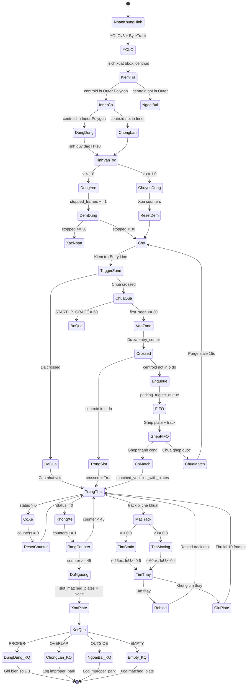

# Mermaid State Diagram - Parking Detection System

```mermaid
stateDiagram-v2
    direction TB

    [*] --> NhanKhungHinh

    NhanKhungHinh --> YOLO : YOLOv8 + ByteTrack
    YOLO --> KiemTra : Trich xuat bbox, centroid

    KiemTra --> InnerCo : centroid in Outer Polygon
    KiemTra --> NgoaiBai : centroid not in Outer
    InnerCo --> DungDung : centroid in Inner Polygon
    InnerCo --> ChongLan : centroid not in Inner

    DungDung --> TinhVanToc : Tinh quy dao H=10
    ChongLan --> TinhVanToc

    TinhVanToc --> DungYen : v < 1.0
    TinhVanToc --> ChuyenDong : v >= 1.0

    DungYen --> DemDung : stopped_frames += 1
    ChuyenDong --> ResetDem : Xoa counters

    DemDung --> XacNhan : stopped >= 30
    DemDung --> Cho : stopped < 30
    ResetDem --> Cho

    Cho --> TriggerZone : Kiem tra Entry Line
    TriggerZone --> DaQua : Da crossed
    TriggerZone --> ChuaQua : Chua crossed
    DaQua --> TrangThai : Cap nhat vi tri
    ChuaQua --> VaoZone : first_seen <= 30
    ChuaQua --> BoQua : STARTUP_GRACE = 60
    VaoZone --> Crossed : Du xa entry_center
    Crossed --> TrongSlot : centroid in o do
    Crossed --> Enqueue : centroid not in o do

    TrongSlot --> TrangThai : crossed = True
    Enqueue --> FIFO : parking_trigger_queue
    FIFO --> GhepFIFO : Ghep plate + track
    GhepFIFO --> CoMatch : Ghep thanh cong
    GhepFIFO --> ChuaMatch : Chua ghep duoc
    CoMatch --> TrangThai : matched_vehicles_with_plates
    ChuaMatch --> Cho : Purge stale 15s

    TrangThai --> CoXe : status > 0
    TrangThai --> KhongXe : status = 0
    CoXe --> ResetCounter : counters = 0
    KhongXe --> TangCounter : counters += 1

    TangCounter --> DuNguong : counter >= 45
    TangCounter --> TrangThai : counter < 45
    DuNguong --> XoaPlate : slot_matched_plates = None
    ResetCounter --> TrangThai

    TrangThai --> MatTrack : track bi che khuat
    MatTrack --> TimStatic : v < 0.8
    MatTrack --> TimMoving : v >= 0.8

    TimStatic --> TimThay : r=25px, IoU>=0.6
    TimMoving --> TimThay : r=60px, IoU>=0.4
    TimThay --> Rebind : Tim thay
    TimThay --> GiuPlate : Khong tim thay

    Rebind --> TrangThai : Rebind track moi
    GiuPlate --> TrangThai : Thu lai 10 frames

    XoaPlate --> KetQua

    KetQua --> DungDung_KQ : PROPER
    KetQua --> ChongLan_KQ : OVERLAP
    KetQua --> NgoaiBai_KQ : OUTSIDE
    KetQua --> Empty_KQ : EMPTY

    DungDung_KQ --> [*] : Ghi bien so DB
    ChongLan_KQ --> [*] : Log improper_park
    NgoaiBai_KQ --> [*] : Log improper_park
    Empty_KQ --> [*] : Xoa matched_plate
```
